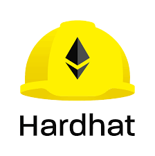

## Hey 👋, I'm [Roqeeb Bello!](https://github.com/milk-maid/)

<!--  -->

### Nice to have you around! &nbsp;  

I'm a bachelor's degree holder 🎓 in Physics Education 🏛. I'm a passionate learner who's always willing to learn and work across technologies and domains 💡. I love to explore new technologies and leverage them to solve real-life problems ✨. Apart from that I also love mentorship relationships 👨🏻‍💻. I'm currently into BlockChain Development 🕸️ and working on my Data Structures and Algorithms and other languages 🤓.

Joined Github **3** years ago.

<!-- Since then I pushed **2**+ commits, opened **2**+ issues, submitted **2**+ pull requests, created **2**+ gists and contributed to **2**+ public repositories. -->

Like My Work?

### Talking about Personal Stuff:

- 🛠 &nbsp; I’m currently working with Solidity, Foundry, Hardhat, JavaScript, React, C, NEXT, HTML, Tailwindcss, etc.
- 🚀 &nbsp; I’m currently exploring Smart Contract Security (Solidity & Cairo for L2).
- 👨🏻‍💻 &nbsp; Most of my projects are available here on [Github](https://github.com/milk-maid).
- 💬 &nbsp; Ask me about anything [here](https://t.me/the_roqbell/)! I am happy to help.
- 👾 &nbsp; Fun fact: Equal is Not Always Equal in Javascript.
- 📫 &nbsp; How to reach me: roqbell@gmail.com
- 📝 &nbsp; Checkout my [Resume](https://github.com/milk-maid/milk-maid/blob/main/resume.pdf).

### My Absolute Favorites:

- 💻 &nbsp; I love exploring new tech stacks and building cool stuff.
- 📰 &nbsp; Reading & writing tech blogs whenever possible.
- 🍕 &nbsp; Hackathons, meetups & tech events.

### Languages and Tools:

&nbsp;
&nbsp;
&nbsp;
&nbsp;
&nbsp;
&nbsp;
&nbsp;

&nbsp;
 solidity
 tailwind  hardhat
 foundry
C
NextJS
golang
terminal

<!-- 

<code></code>
<code></code>
<code></code>
<code></code>
<code></code>
<code></code> 
<code></code>

-->
 

### Projects and Dev Stuffs:

- NFT.
- Auction, Staking, Farm, Trading Contracts.
- UniswapV2 & V3, Chainlink.
- Smart contracts in general.  

|  |  |
| ---------------------------------------------------------------------------------------------------------------------------------------------------------------------------------------------------------------------------------------------------- | ---------------------------------------------------------------------------------------------------------------------------------------------------------------------------------------------------------- |

<!-- 
	
  
<b>⚡ Github Stats</b>

   
  
  

	
  
<b>☄️ Github Streaks</b>

   
  

  
<b>🧑‍🚀 Open Source Projects</b>

   
  <table>
    <thead align="center">
      <tr border: none;>
        <td><b>💻 Projects</b></td>
        <td><b>🌟 Stars</b></td>
        <td><b>🍴 Forks</b></td>
        <td><b>🐛 Issues</b></td>
        <td><b>🔔 Pull Requests</b></td>
        <td><b>👨‍💻 Language</b></td>
      </tr>
    </thead>
    <tbody>
      <tr>
	      <td><a href="https://github.com/iampavangandhi/Gitwar"><b>🚀 Gitwar</b></a></td>
        <td></td>
        <td></td>
        <td></td>
        <td></td>
        <td></td>
      </tr>
      <tr>
	      <td><a href="https://github.com/iampavangandhi/TradeByte"><b>💸 TradeByte</b></a></td>
        <td></td>
        <td></td>
        <td></td>
        <td></td>
        <td></td>
      </tr>
      <tr>
	      <td><a href="https://github.com/iampavangandhi/TheNodeCourse"><b>👨🏻‍💻 TheNodeCourse</b></a></td>
        <td></td>
        <td></td>
        <td></td>
        <td></td>
        <td></td> 
      </tr>
      <tr>
	      <td><a href="https://github.com/iampavangandhi/iampavangandhi"><b>🤓 iampavangandhi</b></a></td>
        <td></td>
        <td></td>
        <td></td>
        <td></td>
        <td></td> 
      </tr>
    </tbody>
  </table>
   

 -->
 

	
   
  
<b>⚙️ Things I use to get stuff done</b>

  	<ul>
  	    <li><b>OS:</b> Manjaro</li>
	    <li><b>Laptop: </b> DELL</li>
  	    <li><b>Browser: </b> Chrome Web Browser</li>
	    <li><b>Terminal: </b> ZSH: Oh My Zsh </li>
	    <li><b>Code Editor:</b> VSCode - The best editor out there.</li>
	    <li><b>To Stay Updated:</b> Dev.to, Medium, Linkedin and Twitter.</li>
	     
	⚛️ Checkout My VSCode Configrations
	</ul>	

#

### Show some ❤️ by starring some of the repositories!

